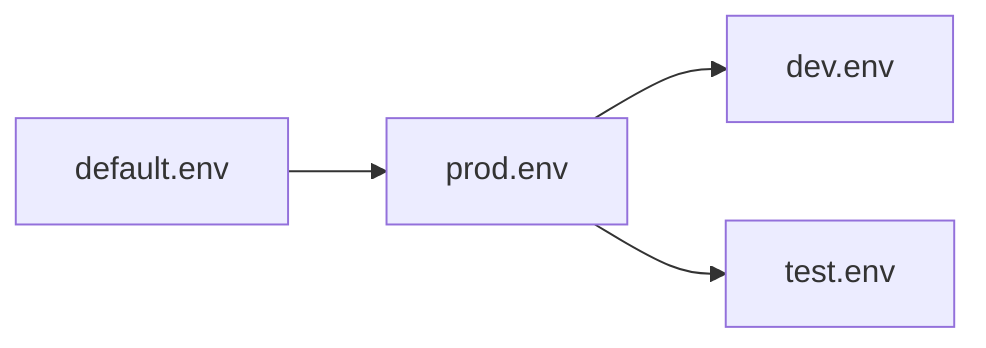

envstack
========

Environment variable composition and activation layer for tools and processes.

> envstack is what `.env` files wish they were when they grew up.

## Why envstack?

- Hierarchical environment composition
- Explicit precedence and overrides
- Late-bound environment activation
- Shared, policy-driven environments
- Inspectable and deterministic behavior

envstack environments are layered hierarchically, with later layers inheriting
from and overriding earlier ones.



Later layers override earlier ones. Use envstack -t VAR to trace where a value
comes from. envstack focuses on **configuration and activation**, not dependency
resolution.

For the core concepts, see
[docs/index.md](https://github.com/rsgalloway/envstack/blob/master/docs/index.md).

## Installation

The easiest way to install:

```bash
pip install -U envstack
```

## Quickstart

Start by getting the latest
[default.env](https://github.com/rsgalloway/envstack/blob/master/examples/default/default.env) 
example file:

```bash
curl -o \
default.env \
https://raw.githubusercontent.com/rsgalloway/envstack/master/examples/default/default.env
```

Running `envstack` will launch a new shell session with the resolved environment:

```shell
$ envstack
🚀 Launching envstack shell... (CTRL+D or "exit" to quit)
(prod) ~$ echo $ENV
prod
```

To inspect the unresolved environment (before variable expansion):

```bash
$ envstack -u
DEPLOY_ROOT=${ROOT}/${ENV}
ENV=prod
ENVPATH=${DEPLOY_ROOT}/env:${ENVPATH}
LOG_LEVEL=${LOG_LEVEL:=INFO}
PATH=${DEPLOY_ROOT}/bin:${PATH}
PS1=\[\e[32m\](${ENV})\[\e[0m\] \w\$ 
PYTHONPATH=${DEPLOY_ROOT}/lib/python:${PYTHONPATH}
ROOT=/mnt/pipe
STACK=default
```

```bash
$ envstack -r DEPLOY_ROOT
DEPLOY_ROOT=/mnt/pipe/prod
```

## How envstack finds environments

envstack discovers environment definitions via the `ENVPATH` environment variable.
`ENVPATH` is to envstack what `PATH` is to executables:

```bash
ENVPATH=/path/to/dev/env:/path/to/prod/env
```
In this case, environments in dev override or layer on top of environments in
prod.

## Converting `.env` files

Convert existing `.env` files to envstack by piping them into envstack:

```bash
cat .env | envstack --set -o out.env
```

## Running Commands

To run any command line executable inside of an environment stack, where
`[COMMAND]` is the command to run:

```bash
$ envstack [STACK] -- [COMMAND]
```

For example:

```bash 
$ envstack -- echo {ENV}
prod
```

Example of injecting environment into a subprocess:

```bash
$ echo "console.log('Hello ' + process.env.ENV)" > index.js
$ node index.js 
Hello undefined
$ envstack -- node index.js 
Hello prod
```

## Secrets and encryption

envstack supports optional encryption of environment values when writing
environment files, allowing sensitive configuration to be safely stored,
committed, or distributed.

Encryption protects values **at rest** and integrates with environment stacks and
includes. envstack does not attempt to be a full secret management system.

See [docs/secrets.md](https://github.com/rsgalloway/envstack/blob/master/docs/secrets.md) for details.

## Documentation

- [Design & philosophy](https://github.com/rsgalloway/envstack/blob/master/docs/design.md)
- [Examples & patterns](https://github.com/rsgalloway/envstack/blob/master/docs/examples.md)
- [Tool comparisons](https://github.com/rsgalloway/envstack/blob/master/docs/comparison.md)
- [Secrets and encryption](https://github.com/rsgalloway/envstack/blob/master/docs/secrets.md)
- [FAQ & gotchas](https://github.com/rsgalloway/envstack/blob/master/docs/faq.md)
- [API docs](https://github.com/rsgalloway/envstack/blob/master/docs/api.md)
