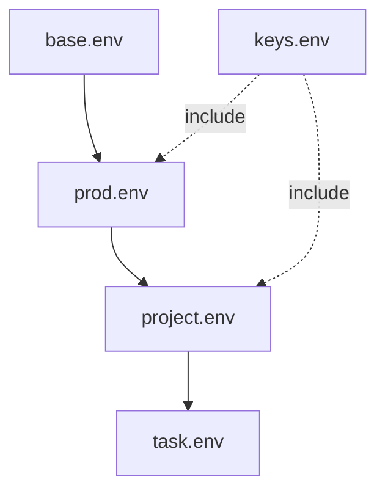

# Design and Philosophy

This document describes the core design principles, mental model, and
non-goals of envstack.

It is intended to explain *why* envstack behaves the way it does, not to
document every feature or command-line option.

## Design goals

envstack is designed to make environment configuration:

- **Explicit** — no hidden behavior
- **Composable** — environments can be layered and reused
- **Deterministic** — the same inputs always produce the same result
- **Inspectable** — values can be traced and resolved before execution
- **Context-aware** — configuration can vary by environment, project, or task

envstack assumes that real-world environments are hierarchical and that
configuration should reflect that structure.

## Mental model

envstack treats environment configuration as a **stack**.

Each layer contributes variables, defaults, or overrides. Layers are applied
in a defined order, and precedence is explicit.

You can think of envstack as:

> **Environment activation + configuration layering**

or:

> **Policy-driven composition of environment variables**

envstack does not attempt to infer intent or solve dependency graphs. All
composition is declared explicitly.

The shortest useful rule is:

> **Files identify stacks; directories identify scope; `ENVPATH` defines precedence.**

For example, these files all describe the same stack in different scopes:

```text
/studio/prod/env/mytool.env
/studio/dev/env/mytool.env
/studio/project/foo/env/mytool.env
```

`mytool.env` identifies the tool or stack being configured. The containing
directory identifies the scope in which that definition applies.

## Environment stacks

An *environment stack* is an ordered collection of environment definitions.

Stacks may be composed by:
- Naming multiple environments
- Including other environments
- Combining base, shared, and contextual layers

Variables flow through the stack according to precedence rules.



## Precedence and overrides

Precedence in envstack is **explicit and ordered**.

- Stacks are resolved left to right
- Lower layers override higher layers
- Downstream environments may refine upstream configuration

There is no implicit merging or magic behavior. If a value changes, it is
because a later layer overrides it.

This makes environment behavior predictable and debuggable.

## Hierarchy and inheritance

envstack environments are typically arranged hierarchically:

- Facility or global base
- Environment tier (dev, prod, CI)
- Project or tool
- Task or invocation

Downstream environments inherit upstream configuration and apply targeted
overrides. This avoids duplication while preserving clarity.

# ENVPATH

envstack discovers environment definitions using the `ENVPATH` environment
variable.

`ENVPATH` is an ordered, colon-separated list of directories that envstack
searches when resolving environment names.

Earlier `ENVPATH` entries win when the same env name exists in multiple
locations:

```bash
ENVPATH=/mnt/tools/dev/env:/mnt/tools/prod/env
```

Resolution follows these rules:
- Earlier paths have higher precedence
- Filesystem layout defines hierarchy and scope
- Changes take effect at activation time

`ENVPATH` is intentionally simple and filesystem-backed. It allows:
- Shared, network-deployed environments
- Hierarchical overrides by putting highest-priority scopes first
- Late binding of configuration without rebuilds

`ENVPATH` plays the same role for envstack that `PATH` plays for executables.

For example:

```bash
export ENVPATH=/studio/project/foo/env:/studio/prod/env
envstack mytool
```

In that case envstack resolves `mytool.env` from both directories, but the
project-scoped definition has higher precedence because its directory appears
first in `ENVPATH`.

## Configuration ownership and revision control

envstack deliberately separates configuration composition from source control
and deployment.

Recommended practice:

> **Environment definitions should be revision-controlled with the system or scope that owns them. Their deployed filesystem location defines scope, while `ENVPATH` defines precedence.**

That usually means there is not one repository containing every version of a
stack such as `mytool.env`.

An application repository may own its canonical definition:

```text
mytool.git/
    env/
        mytool.env
```

A facility or site configuration repository may own organization-wide policy:

```text
studio-config.git/
    env/
        mytool.env
        maya.env
```

After deployment, those files might live at:

```text
/studio/prod/env/mytool.env
```

A project configuration repository can then add project-specific overrides:

```text
foo-config.git/
    env/
        mytool.env
```

deployed to:

```text
/studio/project/foo/env/mytool.env
```

At runtime:

```bash
export ENVPATH=/studio/project/foo/env:/studio/prod/env
envstack mytool
```

The project-scoped definition overrides the facility-scoped definition without
requiring either repository to own the other's history.

### Stack and scope are different dimensions

Names such as `mytool` and scopes such as `prod`, `dev`, or `project/foo`
represent different concerns.

```text
                  stack
                   |
/studio/prod/env/mytool.env
        |
       scope
```

envstack does not prescribe a fixed hierarchy. What matters is that scopes are
represented by directories and combined explicitly through `ENVPATH`.

### Avoid environment branches as the primary model

As a general operating model, it is usually better not to represent runtime
scopes primarily as Git branches such as `prod`, `dev`, or `project-foo`.

That pattern tends to couple application revision and runtime configuration too
tightly, makes it harder to run the same application revision under different
contexts, and blurs ownership of configuration history.

This is a recommendation, not a prohibition. envstack does not require any
particular repository layout.

### Relationship to deployment tools

envstack is not a Git client, package manager, or deployment system.

Revision-controlled environment definitions still need to be published to the
filesystem locations referenced by `ENVPATH`. That publication can happen
manually, through CI/CD, via configuration management, or through a deployment
tool such as [distman](https://distman.dev).

Conceptually:

```text
Git repository
    |
    v
deployment or distribution system
    |
    v
scoped env directories
    |
    v
ENVPATH ordering
    |
    v
envstack activation
```

## Includes

Environment definitions may include other environments explicitly.

Includes allow:
- Reuse of shared base configuration
- Clear dependency relationships between environments
- Modular composition without copy-paste

Includes are declarative and resolved as part of the stack.

## Variable resolution

Variables may:
- Reference other variables
- Define defaults
- Require values to be set

Resolution follows shell-like semantics and is performed explicitly.

envstack allows:
- Resolving values without executing commands
- Inspecting unresolved vs resolved environments
- Tracing where values originate

This makes configuration errors visible early.

## What envstack does not do (non-goals)

envstack intentionally does **not**:
- Install dependencies
- Resolve version constraints
- Enforce isolated runtimes automatically
- Manage interpreters or binaries
- Guess user intent

Those concerns are left to other tools or to policy defined by the user.

envstack focuses solely on **composition and activation of configuration**.

## Composability with other systems

envstack is designed to compose cleanly with other systems.

It can be layered on top of:
- Pre-existing runtimes
- Shared tool deployments
- System-level configuration
- CI/CD environments

envstack does not require a specific packaging or deployment model. It assumes
only that environments can be described declaratively.

## Early binding vs late binding environments

envstack uses a **late-binding environment model**.

Environments are resolved at **activation time**, not at install time, build
time, or package-resolution time.

This means:
- Environments are not frozen snapshots
- Shared environments can evolve
- Tools intentionally pick up updates on next invocation
- Version changes propagate by policy, not rebuilds

This model contrasts with:
- Virtual environments or conda, which bind dependencies early
- Containers, which freeze environments at image build time
- Solver-driven systems, which bind environments during resolution

envstack treats environments as **live configuration**, composed explicitly
each time they are activated.

Late binding is a deliberate design choice. It favors:
- Shared, network-deployed environments
- Centralized updates
- Policy-driven overrides
- Reduced duplication of runtimes

envstack provides policy-defined isolation rather than runtime-enforced
isolation, relying on explicit configuration and directory layout.

## Opinionated by design

envstack is intentionally opinionated:

- Explicit over implicit
- Layered over flat
- Declarative over procedural
- Inspectable over magical

These constraints exist to keep complex environments understandable at scale.

## Summary

envstack exists to make hierarchical environment configuration:
- Predictable
- Reusable
- Inspectable
- Maintainable

It embraces complexity where it exists, rather than hiding it behind
implicit behavior.
