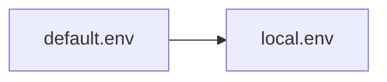
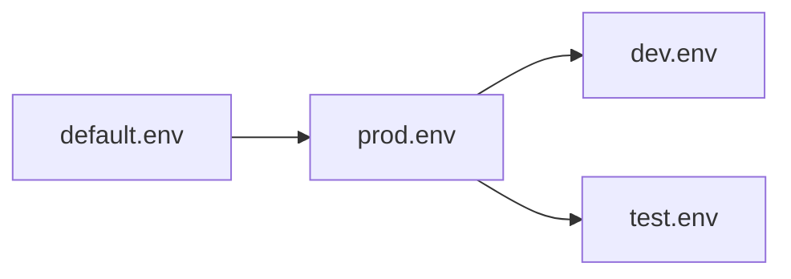
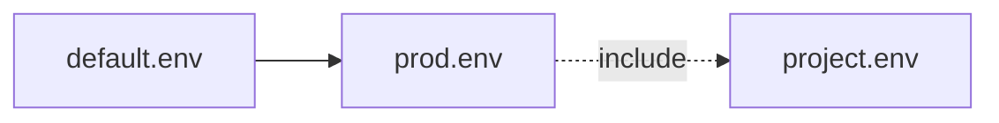
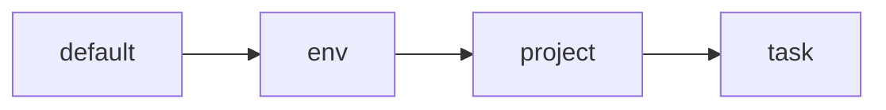

# Examples and Usage Patterns

This document walks through common envstack usage patterns at a conceptual
level and points to concrete examples under the `examples/` directory.

The goal is to show *how envstack is typically used*, not to exhaustively
document every feature.

## Basic stacked environment

**Pattern:** single base environment with simple defaults

This is the simplest envstack use case and a direct evolution of a `.env` file.

Typical characteristics:
- One default base environment
- A small number of variables
- Defaults that can be overridden externally

Common use cases:
- Local development
- Small tools
- CI jobs with minimal configuration

**Example:**  
`examples/default/`

## Environment tiers (dev / prod / CI)

**Pattern:** shared base + environment-specific overrides

A common pattern is to define a shared base environment and layer environment
tiers on top (e.g. dev, prod, CI).

Typical characteristics:
- A default base environment defines common paths and defaults
- Environment tiers override a small number of variables
- The active environment is explicit

Common use cases:
- Deployment pipelines
- Services running in multiple environments
- Developer workstations vs CI

**Example:**  
`examples/default/`

## Project-level environments

**Pattern:** shared facility base + project-specific configuration

Projects often share infrastructure but differ in paths, naming, or behavior.
envstack models this naturally through inheritance and layering.

Typical characteristics:
- Facility or global default environment
- Project environment that includes the base
- Minimal duplication of shared configuration

Common use cases:
- Multi-project repositories
- Studios or organizations with shared tooling
- Per-project overrides without copy-paste

**Example:**  
`examples/project/`

## Hierarchical composition

**Pattern:** base → environment → project → task

This pattern combines multiple layers into a single stack, with each layer
responsible for a specific concern.

Typical characteristics:
- Clear separation of responsibility per layer
- Downstream layers override upstream values
- Configuration remains inspectable at every stage

Common use cases:
- Complex pipelines
- Large tool ecosystems
- Task-specific overrides

## Summary

These examples demonstrate how envstack is typically used to model real-world
environment configuration:

- Layered
- Hierarchical
- Explicit
- Inspectable

Start with the simplest example and build up complexity as needed.
