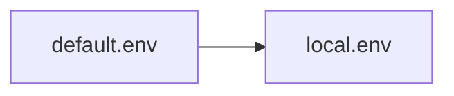
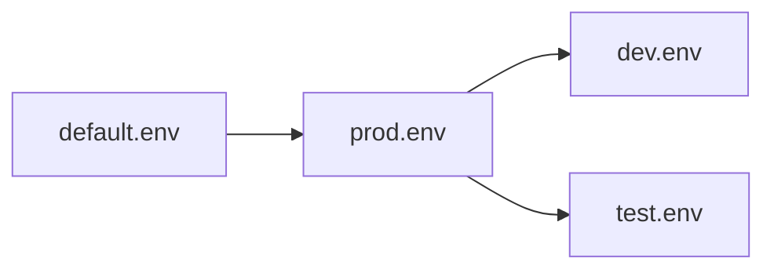
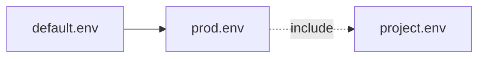
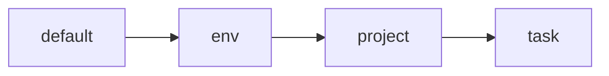

# Examples and Usage Patterns

This document walks through common envstack usage patterns at a conceptual
level and points to concrete examples under the `examples/` directory.

The goal is to show *how envstack is typically used*, not to exhaustively
document every feature.

## Basic stacked environment

**Pattern:** single base environment with simple defaults

This is the simplest envstack use case and a direct evolution of a `.env` file.


```mermaid
flowchart LR
  default[default.env] --> local[local.env]
```

Typical characteristics:
- One default base environment
- A small number of variables
- Defaults that can be overridden externally

Common use cases:
- Local development
- Small tools
- CI jobs with minimal configuration

**Example:**  
`examples/default/`

Try it:

```bash
export ENVPATH=./examples/default
envstack default -u
envstack default -r DEPLOY_ROOT
```

Representative output:

```bash
DEPLOY_ROOT=${ROOT}/${ENV}
ENV=prod
ROOT=/mnt/pipe
STACK=default
```

```bash
DEPLOY_ROOT=/mnt/pipe/prod
```

## Environment tiers (dev / prod / CI)

**Pattern:** shared base + environment-specific overrides

A common pattern is to define a shared base environment and layer environment
tiers on top (e.g. dev, prod, CI).


```mermaid
flowchart LR
  default[default.env] --> prod[prod.env]
  prod --> dev[dev.env]
  prod --> test[test.env]
```

Typical characteristics:
- A default base environment defines common paths and defaults
- Environment tiers override a small number of variables
- The active environment is explicit

Common use cases:
- Deployment pipelines
- Services running in multiple environments
- Developer workstations vs CI

**Example:**  
`examples/default/`

The `dev.env` example includes `default` and overrides only a few variables:

```bash
export ENVPATH=./examples/default
envstack dev -u
```

```bash
DEPLOY_ROOT=${ROOT}/dev
ENV=dev
ENVPATH=${ROOT}/dev/env:${ROOT}/prod/env:${ENVPATH}
LOG_LEVEL=DEBUG
PATH=${ROOT}/dev/bin:${ROOT}/prod/bin:${PATH}
PYTHONPATH=${ROOT}/dev/lib/python:${ROOT}/prod/lib/python:${PYTHONPATH}
ROOT=/mnt/pipe
STACK=dev
```

This is the core layered pattern: the base stack carries shared defaults while
the environment-specific stack changes only the values that differ.

## Project-level environments

**Pattern:** shared facility base + project-specific configuration

Projects often share infrastructure but differ in paths, naming, or behavior.
envstack models this naturally through inheritance and layering.


```mermaid
flowchart LR
  default[default.env] --> prod[prod.env]
  prod -. include .-> project[project.env]
```

Typical characteristics:
- Facility or global default environment
- Project environment that includes the base
- Minimal duplication of shared configuration

Common use cases:
- Multi-project repositories
- Studios or organizations with shared tooling
- Per-project overrides without copy-paste

**Example:**  
`examples/project/`

This example makes the active stack name part of the resolved path layout:

```bash
export ENVPATH=./examples/default:./examples/project
envstack project -u
envstack project test -q
envstack project foobar -q
```

Representative unresolved values:

```bash
ENV=${STACK:=${ENV}}
DEPLOY_ROOT=${ROOT}/${ENV}
ENVPATH=${ROOT}/${ENV}/env:${ROOT}/prod/env
PATH=${ROOT}/${ENV}/bin:${ROOT}/prod/bin:${PATH}
PYTHONPATH=${ROOT}/${ENV}/lib/python:${ROOT}/prod/lib/python:${PYTHONPATH}
STACK=project
```

That pattern is useful when deployments are published to a predictable root and
the stack name selects the active project, branch, or task context.

## Structured values

The `examples/default/data.env` file shows that envstack can carry more than
plain strings:

```bash
export ENVPATH=./examples/default
envstack data -u
envstack data -r CHAR_LIST
```

```bash
CHAR_LIST=['a', 'b', 'c', '${HELLO}']
DICT={'a': 1, 'b': 2, 'c': '${INT}'}
FLOAT=1.0
HELLO=world
INT=5
NUMBER_LIST=[1, 2, 3]
```

```bash
CHAR_LIST=['a', 'b', 'c', 'world']
```

This is handy when a stack needs lightweight structured configuration without a
separate config file format.

## Secrets and encrypted values

The `examples/encryption/` directory demonstrates encrypted nodes and key
stacks:

```bash
export ENVPATH=./examples/default:./examples/encryption
envstack --keygen -o keys.env
envstack -o secrets.env --encrypt
envstack keys secrets -r SECRET
```

The checked-in sample `secrets.env` shows all three value styles together:

```yaml
KEY: !base64 VGhpcyBpcyBlbmNyeXB0ZWQ=
SECRET: !encrypt /xI0Irbiz8ulfQ6n2hjBAH+UqC2z1oFP2FpFaZpj13/ZAKZLoG4Vrkeq3em26vECuaD7pRfwdF9f4pVm
PASSWORD: !fernet gAAAAABne1k8TcnriaO66SWjulyQE7Qn7iSxL_b0FjyxLFI_o9qalH7xzJyXZFOlChYgT2skbFsTop8bWWhzaMEL5CEFe8yF1A==
```

That gives you a practical pattern for storing encrypted values in versioned
stack files while keeping decryption keys separate.

## Wrappers and launchers

The `examples/wrappers/` directory shows how to package an executable that
always runs inside a known stack:

```bash
hello HELLO
```

The companion `hello.env` defines:

```yaml
HELLO: world
PYEXE: /usr/bin/python
```

The wrapper then resolves `${PYEXE}` and prints the requested environment
variable. This pattern is useful for tool launchers, bootstrap scripts, and
small command shims.

## Hierarchical composition

**Pattern:** base → environment → project → task

This pattern combines multiple layers into a single stack, with each layer
responsible for a specific concern.


```mermaid
flowchart LR
  default --> env --> project --> task
```

Typical characteristics:
- Clear separation of responsibility per layer
- Downstream layers override upstream values
- Configuration remains inspectable at every stage

Common use cases:
- Complex pipelines
- Large tool ecosystems
- Task-specific overrides

## Summary

These examples demonstrate how envstack is typically used to model real-world
environment configuration:

- Layered
- Hierarchical
- Explicit
- Inspectable

Start with the simplest example and build up complexity as needed.
