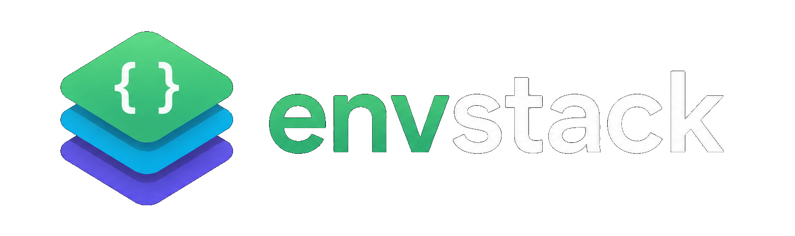

<p align="left">
  
</p>

envstack is an **environment variable composition and activation layer** for
tools and processes.

It is built for cases where environments are hierarchical, shared, and
context-dependent, and where a flat `.env` file stops being enough.

```bash
export ENVPATH=studio/base:show/foo:tool/nuke/14
envstack -- nuke
```

## Why envstack

envstack is a lightweight CLI and Python library for composing, tracing,
exporting, and reproducing environment variables using a PATH-like model
called `ENVPATH`.

### Compose

- Hierarchical environment layers
- Ordered precedence and overrides
- Cross-platform environment activation

### Explain

- Trace variable origins
- Inspect unresolved values
- Debug stack ordering and overrides

### Export

- Bake resolved environments
- Export to shell formats
- Reproduce environments deterministically

## ENVPATH

`ENVPATH` defines **where** environment fragments are discovered and **in what
order** they apply, similar to `PATH`, but for full environments.

```bash
export ENVPATH=prod/base:prod/show/foo:prod/tools/nuke14
envstack -- nuke
```

Later entries can layer on top of earlier ones through includes, hierarchy, and
explicit precedence rules.

## envstack is not

- A dependency solver
- A package manager
- A virtualenv replacement
- A build system

It is intentionally boring: explicit inputs, deterministic outputs, and tooling
that tells you what it did.

## Install

```bash
pip install -U envstack
```

## Quickstart

Start with the repository's baseline example:

```bash
curl -o default.env \
  https://raw.githubusercontent.com/rsgalloway/envstack/master/examples/default/default.env
```

Running `envstack` launches a shell with the resolved stack active:

```bash
$ envstack
🚀 Launching envstack shell... (CTRL+D or "exit" to quit)
(prod) ~$ echo $ENV
prod
```

Inspect the unresolved environment:

```bash
envstack -u
```

Typical output from `examples/default/default.env` looks like:

```bash
DEPLOY_ROOT=${ROOT}/${ENV}
ENV=prod
ENVPATH=${DEPLOY_ROOT}/env:${ENVPATH}
LOG_LEVEL=${LOG_LEVEL:=INFO}
PATH=${DEPLOY_ROOT}/bin:${PATH}
PYTHONPATH=${DEPLOY_ROOT}/lib/python:${PYTHONPATH}
ROOT=/mnt/pipe
STACK=default
```

Resolve a specific variable:

```bash
envstack -r DEPLOY_ROOT
```

Run a command inside the active stack:

```bash
envstack -- echo {VAR}
```

For example:

```bash
$ envstack -- echo {ENV}
prod
```

That makes it easy to inject configuration into subprocesses:

```bash
$ echo "console.log('Hello ' + process.env.ENV)" > index.js
$ node index.js
Hello undefined
$ envstack -- node index.js
Hello prod
```

Trace where a variable comes from:

```bash
envstack -t PATH
```

## How envstack finds environments

`ENVPATH` tells envstack where environment fragments live and in what order
they should be discovered, much like `PATH` for executables.

```bash
export ENVPATH=/path/to/prod/env:/path/to/dev/env
```

In that case, stacks found under `/path/to/dev/env` can layer on top of the
shared base definitions in `/path/to/prod/env`.

## Converting `.env` files

You can convert an existing flat `.env` file into an envstack-compatible file:

```bash
cat .env | envstack --set -o out.env
```

## Learn More

- [Design](design.md): mental model, hierarchy, and precedence
- [Examples](examples.md): common patterns and stack layouts
- [Secrets](secrets.md): encrypted values and key handling
- [Comparison](comparison.md): how envstack differs from adjacent tools
- [FAQ](faq.md): operational details and gotchas
- [API](api.md): Python and CLI reference material
- [Roadmap](roadmap.md): planned improvements and future work
